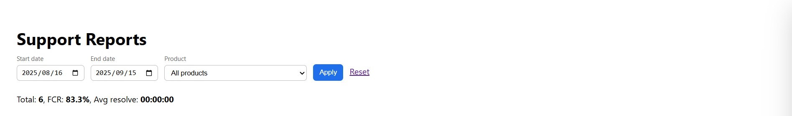

# Support Insights Dashboard

  

A **Symfony + MySQL analytics dashboard** that transforms raw Support Query data into **live KPIs, complaint themes, and downloadable reports**.  
Built as part of my **Afrihost Support → Dev & Data journey** to demonstrate bridging Support operations and Development insights.

---

## 🚀 Features

- **KPI Cards** – Total queries, **First Contact Resolution %**, and **Avg time-to-resolve**
- **Category Split** – Controllable vs Uncontrollable queries
- **Top Complaint Themes** – Top 10 controllable complaint reasons
- **Daily Trend** – Line chart showing queries over the last 30 days
- **Filters** – Date range + Product dropdown
- **CSV Exports** – One-click download for Categories, Themes, Trend, and Raw data

---

## 🧱 Architecture

