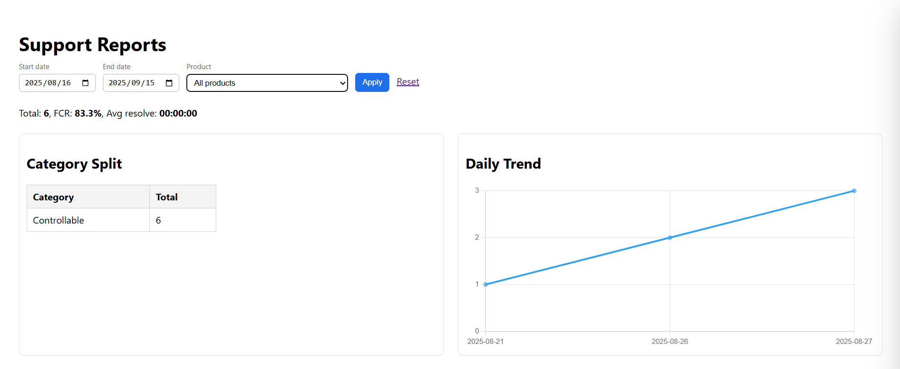
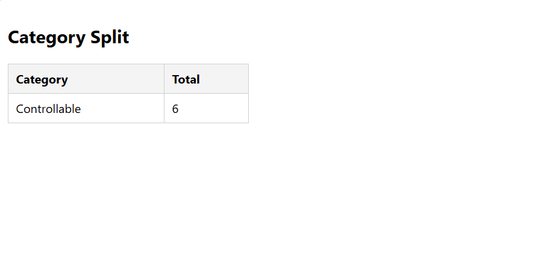
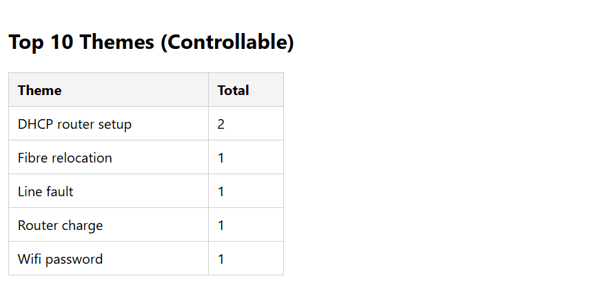
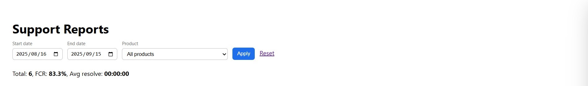
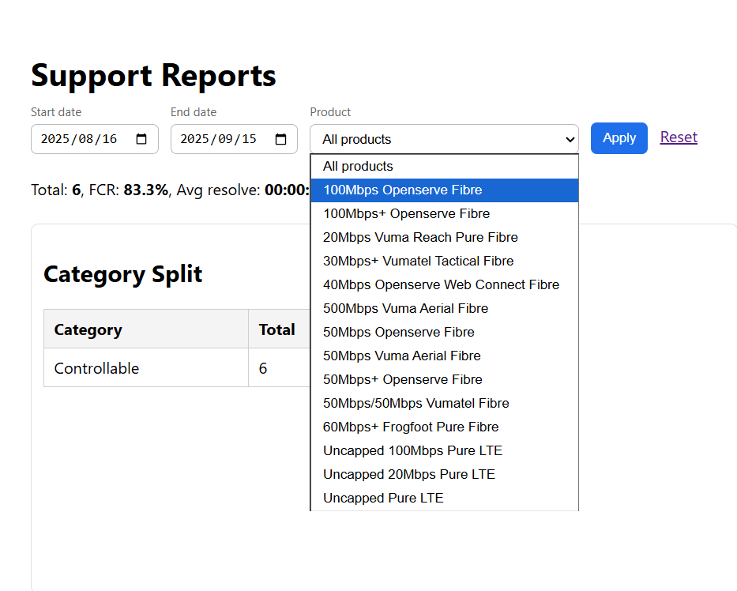

# 📊 Support Insights Dashboard



A **Symfony + MySQL analytics dashboard** that transforms raw Support Query data into  
live **KPIs, complaint themes, and downloadable reports**.  

Built as part of my **Afrihost Support → Dev & Data journey** to demonstrate bridging  
Support operations and Development insights.

---

## 🚀 Features

- **KPI Cards** – Total queries, **First Contact Resolution %**, and **Avg time-to-resolve**  
- **Category Split** – Controllable vs Uncontrollable queries  
- **Top Complaint Themes** – Top 10 controllable complaint reasons  
- **Daily Trend** – Line chart showing queries over the last 30 days  
- **Filters** – Date range + Product dropdown  
- **CSV Exports** – One-click download for Categories, Themes, Trend, and Raw data  

---

## 📸 Screenshots

**Dashboard Overview**  


**Category Split**  


**Top 10 Complaint Themes**  


**KPI Cards**  


**All Products View**  


---

## 🧱 Architecture

- **Frontend**: Twig templates (Symfony)  
- **Backend**: Symfony controllers (PHP)  
- **Database**: MySQL (via Doctrine DBAL)  
- **Server**: XAMPP (Apache + PHP)  
- **ORM/DB Layer**: Doctrine ORM  

---

## ⚙️ Setup

1. **Clone this repository**
   ```bash
   git clone https://github.com/zolilemcelu/support-insights-dashboard.git
   cd support-insights-dashboard

Install dependencies

composer install


Configure environment
Copy .env → .env.local and update with your MySQL credentials:

DATABASE_URL="mysql://root:@127.0.0.1:3306/support_queries?serverVersion=10.4&charset=utf8mb4"


Start the Symfony server

symfony server:start


Visit the dashboard

http://127.0.0.1:8000/support/reports

📥 CSV Import

To load fresh support data into MySQL:

php bin/console app:import-csv support_queries.csv


Expected headers:

query_date,id_number,client_name,call_id,product,query_type,ticket_id,reason_verbatim,reason_normalized,category,action_taken,first_contact_resolution,time_to_resolve,complaint_theme,mojo_notes,mojo_account,notes,in_period

📄 License

MIT License — free to use, modify, and share.

🙌 Credits

Built as part of my Afrihost Support → Dev & Data journey 🚀


---

This version:  
- ✅ Starts with a **hero screenshot**  
- ✅ Lists **features** up front  
- ✅ Shows **screenshots** in a structured way  
- ✅ Explains **architecture** clearly  
- ✅ Provides **step-by-step setup** instructions  
- ✅ Documents the **CSV import** route  
- ✅ Adds **license & credits**  

---

Would you like me to also **show you the exact git commands** to commit this new README and push it to 
